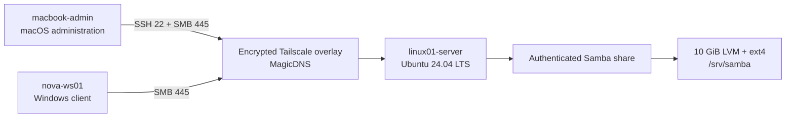

# Enterprise Infrastructure Lab

Hands-on Windows and Linux administration portfolio built around a small,
recoverable enterprise laboratory. The project documents not only what was
configured, but how it was verified and how failures were diagnosed.

## At a Glance

| Area | Implemented evidence |
|---|---|
| Linux administration | Ubuntu Server baseline, APT maintenance, systemd, logs, SSH and UFW |
| Storage | Dedicated LVM logical volume, ext4 filesystem and persistent UUID mount |
| File services | Authenticated Samba share with group-based access and setgid inheritance |
| Networking | Cross-platform Tailscale overlay with MagicDNS and least-privilege firewall rules |
| Automation | Idempotent Bash and PowerShell bootstrap scripts with wizard and check-only modes |
| Validation | macOS and Windows SMB tests, SSH tests, controlled reboot and persistence checks |

## Current Architecture



Incoming traffic on Ubuntu is denied by default. UFW permits only the required
port, source node and `tailscale0` interface. Samba guest access and unused
printing services are disabled.

## Key Deliverables

- [Tailscale bootstrap automation](./02-Automation/README.md) for Ubuntu,
  macOS and Windows
- [Infrastructure plan](./01-Documentation/Infrastructure-Plan.md) with the
  current topology, controls and roadmap
- [Engineering journal](./01-Documentation/Engineering-Journal.md) with six
  concise laboratory records and incident findings
- [Evidence-based skill matrix](./01-Documentation/Skill-Matrix.md)
- [Progress and next milestones](./01-Documentation/Progress.md)

The longer [Linux](./01-Documentation/Linux-Cheatsheet.md) and
[Windows](./01-Documentation/Windows-Cheatsheet.md) runbooks are operational
references, not required reading for this portfolio overview.

## Verified Result

The current three-node environment passed:

- public-key SSH from macOS to Ubuntu over MagicDNS;
- authenticated SMB read/write from macOS and Windows;
- post-reboot recovery of Tailscale, SSH, Samba, UFW and the LVM mount;
- check-only reruns of all platform bootstrap scripts;
- duplicate-safe UFW authorization checks;
- safe cancellation and confirmed execution of the Windows setup wizard;
- repository scans for embedded passwords, tokens and private keys.

These tests validate the current enrolled nodes. First-time installation from
fresh VM snapshots remains the next automation acceptance test.

## Repository Map

```text
01-Documentation/   portfolio evidence, plans, journal and runbooks
02-Automation/      Bash and PowerShell deployment tools
```

Start with the [documentation index](./01-Documentation/README.md) for a
five-minute reading path or open the automation directory for implementation
details.

## Next Milestones

1. Test first-time bootstrap on clean VM snapshots.
2. Design and execute Samba data/configuration backup and restore.
3. Add monitoring for storage, service health and authentication failures.
4. Review effective SSH settings and perform controlled hardening.

## Security Boundary

This repository may contain public hostnames, lab addresses and public-key
fingerprints as evidence. Passwords, passphrases, private keys, auth tokens and
recovery secrets must never be committed.
